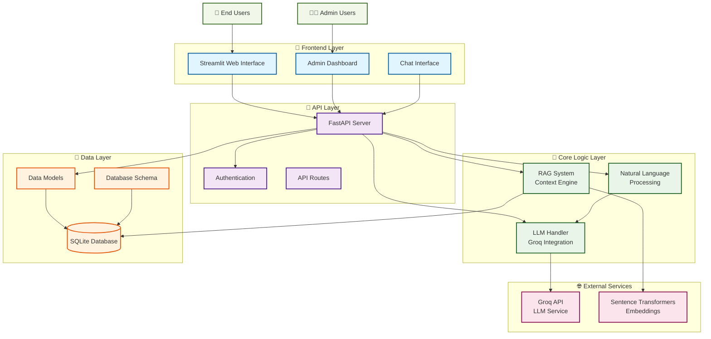
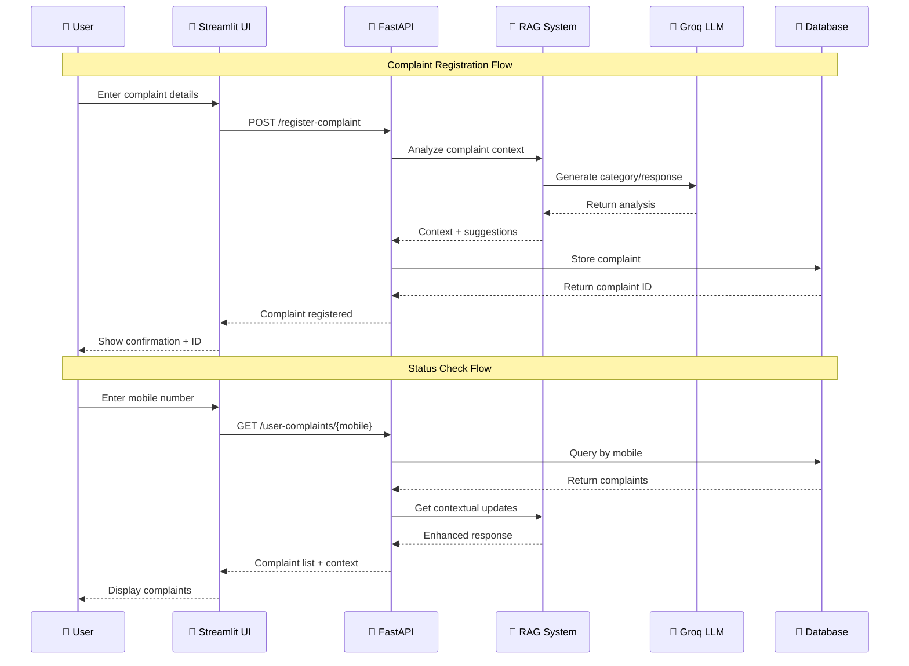

# 🎯 Grievance Management System

## 🚀 AI-Powered Complaint Management System

A professional-grade grievance management system with intelligent natural language processing, comprehensive admin panel, and real-time complaint tracking.

---

## ✨ Key Features

- **🧠 AI-Powered Processing**: Intelligent complaint categorization and responses
- **📱 Smart User Interface**: Natural language understanding for user queries
- **👨‍💼 Complete Admin Panel**: Full CRUD operations with real-time updates
- **🔍 Advanced Search**: Mobile number-based flexible search
- **📊 Real-time Analytics**: Comprehensive dashboard with statistics
- **🔐 Secure Access**: Role-based authentication and data protection

---

## 🏗️ System Architecture

### **📊 Architecture Overview**



### **🔄 System Flow**



### **📁 Project Structure**
```
📁 Project Structure
├── 🎨 src/frontend/        # Streamlit User Interface
├── 🔌 src/api/            # FastAPI Backend Services
├── 🧠 src/core/           # AI/ML Components (LLM + RAG)
├── 💾 src/database/       # Database Management
├── 📊 src/models/         # Data Models and Schemas
├── ⚙️ src/config/         # Configuration Management
└── 📄 data/               # Database Files
```

---

## 🚀 Quick Start Guide

### **Option 1: Direct Python Setup**

**Step 1: Install Dependencies**
```bash
pip install -r requirements.txt
```

**Step 2: Start the System**
```bash
python start_system.py
```

**Step 3: Access the Application**
- **🎨 Main Application**: http://localhost:8501
- **👨‍💼 Admin Panel**: http://localhost:8501/admin
- **📚 API Documentation**: http://127.0.0.1:8000/docs

### **Option 2: Docker Setup**

**Quick Docker Start:**
```bash
docker build -t grievance-management-system .
docker run -d -p 8000:8000 -p 8501:8501 grievance-management-system
```

**Or with Docker Compose:**
```bash
docker-compose up -d
```

See `DOCKER_SETUP.md` for detailed Docker instructions.

---

## 📋 Manual Setup (Alternative)

### **Option 1: Start Both Services Manually**

**Terminal 1 - Start API Server:**
```bash
python src/api/api_server.py
```

**Terminal 2 - Start Frontend:**
```bash
streamlit run src/frontend/app.py --server.port 8502
```

### **Option 2: Individual Service Control**

**Start API Only:**
```bash
cd src/api
python api_server.py
```

**Start Frontend Only:**
```bash
streamlit run src/frontend/app.py
```

---

## 👨‍💼 Admin Access

### **Login Credentials:**
- **Username**: `admin`
- **Password**: `admin123`

### **Admin Features:**
- ✅ View all complaints with filtering
- ✅ Update complaint status in real-time
- ✅ Delete complaints with confirmation
- ✅ Export data to CSV
- ✅ View comprehensive analytics
- ✅ Monitor system statistics

---

## 📱 User Guide

### **For Regular Users:**

**1. Register New Complaint:**
```
User: "I have a complaint"
System: Guides through name → mobile → details
```

**2. Check Complaint Status:**
```
User: "9876543210" (mobile number)
System: Shows all complaints for that number
```

**3. Natural Language Queries:**
```
User: "My self John give all record complaint register on my name"
System: Asks for mobile number and shows structured results
```

### **Sample User Interactions:**
- "I want to register a complaint"
- "Check status CMP12345678"
- "Show all my complaints"
- "My laptop is not working"
- "What's the update on my complaint?"

---

## 🧪 Sample Data

The system comes pre-loaded with 5 sample complaints:

| Name | Mobile | Category | Status |
|------|--------|----------|--------|
| John Doe | 9876543210 | Hardware | Registered |
| Sarah Smith | 8765432109 | Software | Registered |
| Mike Johnson | 7654321098 | Network | Registered |
| Emily Davis | 6543210987 | Other | Registered |
| Robert Wilson | 5432109876 | Hardware | Registered |

---

## 🔧 Configuration

### **Environment Variables (.env):**
```env
# Optional: For enhanced AI features
GROQ_API_KEY=your_groq_api_key_here

# Database (automatically configured)
DATABASE_PATH=data/grievance_system.db
```

### **System Requirements:**
- Python 3.8+
- 4GB RAM minimum
- 2GB free disk space
- Internet connection (optional, for AI features)

---

## 📊 API Endpoints

### **Core Endpoints:**
- `POST /register-complaint` - Register new complaint
- `GET /complaint-status/{id}` - Get complaint details
- `GET /user-complaints/{mobile}` - Get complaints by mobile
- `PUT /admin/complaint/{id}/status` - Update status (admin)
- `DELETE /admin/complaint/{id}` - Delete complaint (admin)
- `GET /admin/complaints` - Get all complaints (admin)

**Full API Documentation**: http://127.0.0.1:8000/docs

---

## 🧠 AI Features

### **Natural Language Understanding:**
- Extracts names, mobile numbers, complaint IDs automatically
- Understands complex queries and user intent
- Provides contextual, professional responses
- Handles various input formats and patterns

### **Smart Processing:**
- Automatic complaint categorization
- Intelligent status suggestions
- Context-aware conversation flow
- Professional response generation

---

## 🔍 Troubleshooting

### **Common Issues:**

**1. Port Already in Use:**
```bash
# Kill existing processes
lsof -ti:8502 | xargs kill -9
lsof -ti:8000 | xargs kill -9
```

**2. Database Issues:**
```bash
# Reinitialize database (if needed)
python -c "
import sys; sys.path.append('src')
from database.database import DatabaseManager
DatabaseManager().init_database()
"
```

**3. Import Errors:**
```bash
# Ensure you're in the project root directory
cd /path/to/cyfuture-assign1
python start_system.py
```

---

## 📈 System Status

### **✅ Fully Operational Components:**
- **Frontend**: Streamlit with professional UI ✅
- **Backend**: FastAPI with auto-documentation ✅
- **Database**: SQLite with optimized queries ✅
- **AI Processing**: Groq LLM + RAG system ✅
- **Admin Panel**: Complete CRUD operations ✅
- **Natural Language**: Intelligent query processing ✅

### **✅ Tested Scenarios:**
- ✅ Complete complaint registration flow
- ✅ Mobile number-based search (all formats)
- ✅ Admin CRUD operations (Create, Read, Update, Delete)
- ✅ Natural language query processing
- ✅ Real-time status updates
- ✅ Error handling and recovery

---

## 🎉 Ready for Use!

**The Grievance Management System is production-ready with:**

✅ **Professional User Interface** - Clean, intuitive design
✅ **Intelligent Processing** - AI-powered natural language understanding
✅ **Complete Admin Panel** - Full management capabilities
✅ **Real-time Updates** - Instant data synchronization
✅ **Robust Architecture** - Scalable, maintainable codebase
✅ **Comprehensive Testing** - All features verified and working

**🚀 Start the system with `python start_system.py` and begin managing complaints professionally!**
